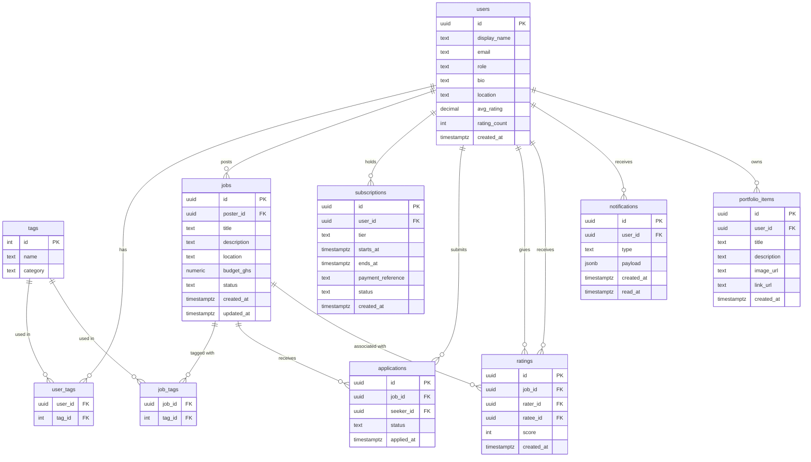

# Database Schema Specification

## Overview

This document defines the PostgreSQL database schema for the QuickHubGH platform. The schema is implemented in Supabase and includes all tables, columns, constraints, and Row Level Security (RLS) policies required for the platform's functionality.

## Entity Relationship Diagram



## Table Definitions

### `users`

Extends `auth.users`. Created via a Supabase trigger on `auth.users` insert.

| Column | Type | Nullable | Constraints | Notes |
|---|---|---|---|---|
| `id` | `uuid` | NOT NULL | PRIMARY KEY, REFERENCES `auth.users(id)` | User identifier |
| `display_name` | `text` | NOT NULL | | User's display name from Google profile |
| `email` | `text` | NOT NULL | | User's email address |
| `role` | `text` | NOT NULL | CHECK (`role` IN ('seeker', 'poster')) | User role: 'seeker' or 'poster' |
| `bio` | `text` | NULL | | User biography, max 500 characters (enforced at app layer) |
| `location` | `text` | NULL | | Free-text location (e.g., "Accra, Ghana") |
| `avg_rating` | `numeric(3,1)` | NULL | | Average rating (1-5), recalculated on each new rating |
| `rating_count` | `int` | NOT NULL | DEFAULT 0 | Count of ratings received |
| `created_at` | `timestamptz` | NOT NULL | DEFAULT `now()` | Record creation timestamp |

### `tags`

Predefined, seeded at deploy time. Not user-editable.

| Column | Type | Nullable | Constraints | Notes |
|---|---|---|---|---|
| `id` | `int` | NOT NULL | PRIMARY KEY, GENERATED BY DEFAULT AS IDENTITY | Tag identifier |
| `name` | `text` | NOT NULL | UNIQUE | Tag name (e.g., 'Tech', 'Cooking', 'Cleaning', 'Handiwork') |
| `category` | `text` | NULL | | Optional grouping category |

### `user_tags`

Junction table linking Seekers to their Skill_Tags.

| Column | Type | Nullable | Constraints | Notes |
|---|---|---|---|---|
| `user_id` | `uuid` | NOT NULL | REFERENCES `users(id)` ON DELETE CASCADE | Foreign key to users |
| `tag_id` | `int` | NOT NULL | REFERENCES `tags(id)` ON DELETE CASCADE | Foreign key to tags |
| PRIMARY KEY | composite | | `(user_id, tag_id)` | Composite primary key |

### `jobs`

Job listings created by Posters.

| Column | Type | Nullable | Constraints | Notes |
|---|---|---|---|---|
| `id` | `uuid` | NOT NULL | PRIMARY KEY, DEFAULT `gen_random_uuid()` | Job identifier |
| `poster_id` | `uuid` | NOT NULL | REFERENCES `users(id)` ON DELETE CASCADE | Foreign key to poster user |
| `title` | `text` | NOT NULL | | Job title, max 100 characters |
| `description` | `text` | NOT NULL | | Job description, max 1000 characters |
| `location` | `text` | NOT NULL | | Job location (free-text) |
| `budget_ghs` | `numeric(10,2)` | NOT NULL | | Budget in Ghanaian Cedis |
| `status` | `text` | NOT NULL | CHECK (`status` IN ('open', 'closed')), DEFAULT 'open' | Job status |
| `created_at` | `timestamptz` | NOT NULL | DEFAULT `now()` | Job creation timestamp |
| `updated_at` | `timestamptz` | NOT NULL | DEFAULT `now()` | Last update timestamp |

### `job_tags`

Junction table linking jobs to tags.

| Column | Type | Nullable | Constraints | Notes |
|---|---|---|---|---|
| `job_id` | `uuid` | NOT NULL | REFERENCES `jobs(id)` ON DELETE CASCADE | Foreign key to jobs |
| `tag_id` | `int` | NOT NULL | REFERENCES `tags(id)` ON DELETE CASCADE | Foreign key to tags |
| PRIMARY KEY | composite | | `(job_id, tag_id)` | Composite primary key |

### `subscriptions`

User subscription records.

| Column | Type | Nullable | Constraints | Notes |
|---|---|---|---|---|
| `id` | `uuid` | NOT NULL | PRIMARY KEY, DEFAULT `gen_random_uuid()` | Subscription identifier |
| `user_id` | `uuid` | NOT NULL | REFERENCES `users(id)` ON DELETE CASCADE | Foreign key to user |
| `tier` | `text` | NOT NULL | | Subscription tier (e.g., 'monthly') |
| `starts_at` | `timestamptz` | NOT NULL | | Subscription start date |
| `ends_at` | `timestamptz` | NOT NULL | | Subscription end date |
| `payment_reference` | `text` | NOT NULL | | Paystack payment reference |
| `status` | `text` | NOT NULL | CHECK (`status` IN ('active', 'expired')), DEFAULT 'active' | Subscription status |
| `created_at` | `timestamptz` | NOT NULL | DEFAULT `now()` | Record creation timestamp |

### `applications`

Job applications submitted by Seekers.

| Column | Type | Nullable | Constraints | Notes |
|---|---|---|---|---|
| `id` | `uuid` | NOT NULL | PRIMARY KEY, DEFAULT `gen_random_uuid()` | Application identifier |
| `job_id` | `uuid` | NOT NULL | REFERENCES `jobs(id)` ON DELETE CASCADE | Foreign key to job |
| `seeker_id` | `uuid` | NOT NULL | REFERENCES `users(id)` ON DELETE CASCADE | Foreign key to seeker user |
| `status` | `text` | NOT NULL | CHECK (`status` IN ('pending', 'viewed', 'engaged')), DEFAULT 'pending' | Application status |
| `applied_at` | `timestamptz` | NOT NULL | DEFAULT `now()` | Application submission timestamp |
| UNIQUE | | | `(job_id, seeker_id)` | Prevents duplicate applications |

### `ratings`

Ratings exchanged between users after job completion.

| Column | Type | Nullable | Constraints | Notes |
|---|---|---|---|---|
| `id` | `uuid` | NOT NULL | PRIMARY KEY, DEFAULT `gen_random_uuid()` | Rating identifier |
| `job_id` | `uuid` | NOT NULL | REFERENCES `jobs(id)` ON DELETE CASCADE | Foreign key to job |
| `rater_id` | `uuid` | NOT NULL | REFERENCES `users(id)` ON DELETE CASCADE | Foreign key to rater user |
| `ratee_id` | `uuid` | NOT NULL | REFERENCES `users(id)` ON DELETE CASCADE | Foreign key to ratee user |
| `score` | `int` | NOT NULL | CHECK (`score BETWEEN 1 AND 5`) | Rating score (1-5) |
| `created_at` | `timestamptz` | NOT NULL | DEFAULT `now()` | Rating creation timestamp |
| UNIQUE | | | `(job_id, rater_id, ratee_id)` | Prevents duplicate ratings per job |

### `notifications`

In-platform notifications for users.

| Column | Type | Nullable | Constraints | Notes |
|---|---|---|---|---|
| `id` | `uuid` | NOT NULL | PRIMARY KEY, DEFAULT `gen_random_uuid()` | Notification identifier |
| `user_id` | `uuid` | NOT NULL | REFERENCES `users(id)` ON DELETE CASCADE | Foreign key to recipient user |
| `type` | `text` | NOT NULL | | Notification type (e.g., 'new_application', 'application_viewed') |
| `payload` | `jsonb` | NULL | | Contextual data (job_id, applicant name, etc.) |
| `created_at` | `timestamptz` | NOT NULL | DEFAULT `now()` | Notification creation timestamp |
| `read_at` | `timestamptz` | NULL | | Timestamp when notification was read (NULL = unread) |

### `portfolio_items`

Portfolio items for Seeker profiles.

| Column | Type | Nullable | Constraints | Notes |
|---|---|---|---|---|
| `id` | `uuid` | NOT NULL | PRIMARY KEY, DEFAULT `gen_random_uuid()` | Portfolio item identifier |
| `user_id` | `uuid` | NOT NULL | REFERENCES `users(id)` ON DELETE CASCADE | Foreign key to user |
| `title` | `text` | NOT NULL | | Item title |
| `description` | `text` | NULL | | Item description, max 300 characters |
| `image_url` | `text` | NULL | | Supabase Storage URL for image |
| `link_url` | `text` | NULL | | External URL link |
| `created_at` | `timestamptz` | NOT NULL | DEFAULT `now()` | Item creation timestamp |

## Row Level Security Policies

All tables have RLS enabled. The following policies apply:

### `users`
- **SELECT**: Authenticated users can read all rows (public profiles).
- **UPDATE**: A user can only update their own row (`auth.uid() = id`).

### `tags`
- **SELECT**: Public (anonymous + authenticated). Tags are read-only reference data.

### `user_tags`
- **SELECT**: Authenticated users can read all rows.
- **INSERT/DELETE**: User can only modify their own rows (`auth.uid() = user_id`).

### `jobs`
- **SELECT**: Authenticated users can read all open jobs; poster can read their own closed jobs.
- **INSERT**: Authenticated users with an active subscription (`EXISTS (SELECT 1 FROM subscriptions WHERE user_id = auth.uid() AND status = 'active' AND ends_at > now())`).
- **UPDATE/DELETE**: Only the poster (`auth.uid() = poster_id`).

### `job_tags`
- **SELECT**: Authenticated users.
- **INSERT/DELETE**: Only the job's poster (join to `jobs` on `poster_id = auth.uid()`).

### `subscriptions`
- **SELECT**: User can only read their own rows (`auth.uid() = user_id`).
- **INSERT/UPDATE**: Service role only (webhook handler). Users cannot self-grant subscriptions.

### `applications`
- **SELECT**: Seeker can read their own applications; poster can read applications for their jobs.
- **INSERT**: Authenticated seeker with active subscription; no duplicate (enforced by UNIQUE constraint).
- **UPDATE**: Poster can update `status` for applications on their jobs.

### `ratings`
- **SELECT**: Authenticated users can read all ratings.
- **INSERT**: Authenticated user; score must be 1–5; no duplicate per `(job_id, rater_id, ratee_id)`.

### `notifications`
- **SELECT/UPDATE**: User can only access their own notifications (`auth.uid() = user_id`).
- **INSERT**: Service role only (server actions insert on behalf of users).

### `portfolio_items`
- **SELECT**: Authenticated users can read all items.
- **INSERT/UPDATE/DELETE**: User can only modify their own items (`auth.uid() = user_id`).

## Indexes

The following indexes should be created for performance:

1. `jobs_status_created_at_idx` ON `jobs` (`status`, `created_at` DESC) - For feed pagination
2. `subscriptions_user_id_status_ends_at_idx` ON `subscriptions` (`user_id`, `status`, `ends_at`) - For subscription gate checks
3. `applications_job_id_seeker_id_idx` ON `applications` (`job_id`, `seeker_id`) - For duplicate prevention
4. `ratings_ratee_id_idx` ON `ratings` (`ratee_id`) - For rating aggregation
5. `notifications_user_id_read_at_created_at_idx` ON `notifications` (`user_id`, `read_at`, `created_at` DESC) - For notification queries
6. `portfolio_items_user_id_created_at_idx` ON `portfolio_items` (`user_id`, `created_at` DESC) - For portfolio display

## Triggers and Functions

### `update_users_avg_rating`
Function to recalculate average rating when a new rating is inserted:

```sql
CREATE OR REPLACE FUNCTION update_users_avg_rating()
RETURNS TRIGGER AS $$
BEGIN
  UPDATE users
  SET 
    avg_rating = (
      SELECT ROUND(AVG(score)::numeric, 1)
      FROM ratings 
      WHERE ratee_id = NEW.ratee_id
    ),
    rating_count = (
      SELECT COUNT(*)
      FROM ratings
      WHERE ratee_id = NEW.ratee_id
    )
  WHERE id = NEW.ratee_id;
  RETURN NEW;
END;
$$ LANGUAGE plpgsql;

CREATE TRIGGER update_avg_rating_trigger
AFTER INSERT ON ratings
FOR EACH ROW
EXECUTE FUNCTION update_users_avg_rating();
```

### `auto_create_user_profile`
Trigger to automatically create a `users` row when a new `auth.users` record is created:

```sql
CREATE OR REPLACE FUNCTION auto_create_user_profile()
RETURNS TRIGGER AS $$
BEGIN
  INSERT INTO public.users (id, display_name, email, role, rating_count)
  VALUES (
    NEW.id,
    NEW.raw_user_meta_data->>'full_name',
    NEW.email,
    'seeker', -- Default role, can be changed in onboarding
    0
  );
  RETURN NEW;
END;
$$ LANGUAGE plpgsql SECURITY DEFINER;

CREATE TRIGGER on_auth_user_created
AFTER INSERT ON auth.users
FOR EACH ROW
EXECUTE FUNCTION auto_create_user_profile();
```

### `cleanup_old_notifications`
Scheduled function to delete notifications older than 30 days:

```sql
CREATE OR REPLACE FUNCTION cleanup_old_notifications()
RETURNS void AS $$
BEGIN
  DELETE FROM notifications
  WHERE created_at < NOW() - INTERVAL '30 days';
END;
$$ LANGUAGE plpgsql;
```

## Migration Notes

1. All tables should be created in the `public` schema.
2. RLS should be enabled on all tables after schema creation.
3. The `tags` table should be seeded with predefined skill categories.
4. The `update_updated_at` trigger should be created for the `jobs` table to automatically update `updated_at` on row updates.
5. All foreign key constraints should use `ON DELETE CASCADE` to maintain referential integrity.
6. The `subscriptions` table requires service role access for webhook handler inserts.