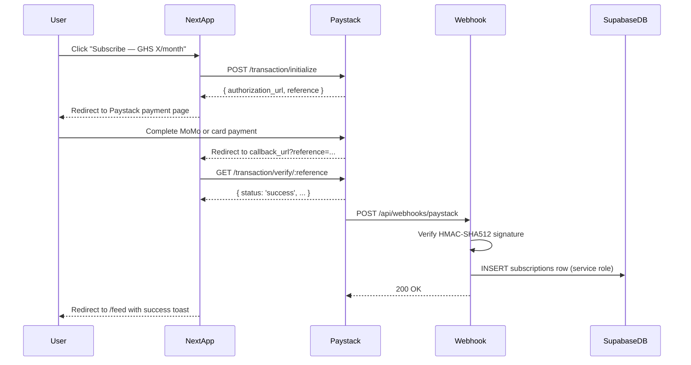

# Payment Flow Specification

## Overview

This document describes the end-to-end subscription purchase flow for the QuickHubGH platform, including the subscription gate implementation and webhook handling logic for payment events. The platform uses Paystack as the primary payment provider, supporting both Mobile Money (MoMo) and card payments in Ghanaian Cedis (GHS).

## Subscription Purchase Flow

### High-Level Flow Diagram



### Detailed Step-by-Step Flow

#### Step 1: User Initiates Subscription Purchase
1. User navigates to `/subscribe` page
2. User selects subscription tier (currently only one tier: monthly)
3. User clicks "Subscribe Now" button
4. Client sends POST request to `/api/subscriptions/initialize`

#### Step 2: Initialize Paystack Transaction
**Endpoint**: `POST /api/subscriptions/initialize/route.ts`

**Request Flow**:
```typescript
// 1. Validate user session
const supabase = createServerClient(cookies());
const { data: { user } } = await supabase.auth.getUser();

if (!user) {
  return NextResponse.json({ error: 'Unauthorized' }, { status: 401 });
}

// 2. Check if user already has active subscription
const { data: existingSubscription } = await supabase
  .from('subscriptions')
  .select('id')
  .eq('user_id', user.id)
  .eq('status', 'active')
  .gt('ends_at', new Date().toISOString())
  .single();

if (existingSubscription) {
  return NextResponse.json({ 
    error: 'active_subscription_exists',
    message: 'You already have an active subscription'
  }, { status: 400 });
}

// 3. Initialize Paystack transaction
const amount = 50 * 100; // 50 GHS in kobo (100 kobo = 1 GHS)
const callbackUrl = `${process.env.NEXT_PUBLIC_APP_URL}/subscribe/callback`;

const response = await fetch('https://api.paystack.co/transaction/initialize', {
  method: 'POST',
  headers: {
    'Authorization': `Bearer ${process.env.PAYSTACK_SECRET_KEY}`,
    'Content-Type': 'application/json',
  },
  body: JSON.stringify({
    email: user.email,
    amount: amount,
    currency: 'GHS',
    callback_url: callbackUrl,
    metadata: {
      user_id: user.id,
      subscription_tier: 'monthly'
    }
  })
});

const data = await response.json();

// 4. Return authorization URL to client
return NextResponse.json({
  authorization_url: data.data.authorization_url,
  reference: data.data.reference
});
```

#### Step 3: User Completes Payment
1. User is redirected to Paystack payment page
2. User selects payment method (MoMo or card)
3. User completes payment authentication
4. Paystack redirects user to `callbackUrl` with `reference` parameter

#### Step 4: Verify Transaction and Redirect
**Endpoint**: `GET /subscribe/callback/page.tsx`

**Client-side verification**:
```typescript
// 1. Extract reference from URL
const searchParams = useSearchParams();
const reference = searchParams.get('reference');

// 2. Verify transaction with Paystack
const verifyResponse = await fetch(`/api/subscriptions/verify?reference=${reference}`);
const verification = await verifyResponse.json();

if (verification.status === 'success') {
  // 3. Show success message and redirect to feed
  router.push('/feed?payment=success');
} else {
  // 4. Show error message and redirect to subscribe page
  router.push('/subscribe?payment=failed&reason=' + verification.message);
}
```

#### Step 5: Webhook Processing (Asynchronous)
**Endpoint**: `POST /api/webhooks/paystack/route.ts`

**Webhook Handler Flow**:
```typescript
// 1. Read raw request body for HMAC verification
const rawBody = await request.text();
const body = JSON.parse(rawBody);

// 2. Verify HMAC-SHA512 signature
const expectedSignature = crypto
  .createHmac('sha512', process.env.PAYSTACK_SECRET_KEY!)
  .update(rawBody)
  .digest('hex');

const signature = request.headers.get('x-paystack-signature');

if (expectedSignature !== signature) {
  return NextResponse.json({ error: 'Invalid signature' }, { status: 400 });
}

// 3. Process only charge.success events
if (body.event !== 'charge.success') {
  return NextResponse.json({ received: true });
}

// 4. Extract payment details
const { reference, customer, amount } = body.data;

// 5. Create Supabase client with service role (bypasses RLS)
const supabase = createClient(
  process.env.NEXT_PUBLIC_SUPABASE_URL!,
  process.env.SUPABASE_SERVICE_ROLE_KEY!
);

// 6. Find user by email
const { data: user } = await supabase
  .from('users')
  .select('id')
  .eq('email', customer.email)
  .single();

if (!user) {
  console.error(`User not found for email: ${customer.email}`);
  return NextResponse.json({ error: 'User not found' }, { status: 404 });
}

// 7. Calculate subscription dates
const startsAt = new Date().toISOString();
const endsAt = new Date(Date.now() + 30 * 24 * 60 * 60 * 1000).toISOString(); // 30 days

// 8. Insert subscription record
const { error } = await supabase
  .from('subscriptions')
  .insert({
    user_id: user.id,
    tier: 'monthly',
    starts_at: startsAt,
    ends_at: endsAt,
    payment_reference: reference,
    status: 'active'
  });

if (error) {
  console.error('Failed to insert subscription:', error);
  return NextResponse.json({ error: 'Database error' }, { status: 500 });
}

// 9. Return success
return NextResponse.json({ received: true });
```

## Subscription Gate Implementation

### Gate Enforcement Layers

The subscription gate operates at two layers for defense in depth:

#### Layer 1: Next.js Middleware (Route-Level Protection)

**File**: `middleware.ts`

**Implementation**:
```typescript
export async function middleware(request: NextRequest) {
  // 1. Create Supabase client for session management
  const supabase = createServerClient({
    cookies: () => ({
      get: (name) => request.cookies.get(name)?.value,
      set: () => {}, // Not used in middleware
      remove: () => {} // Not used in middleware
    })
  });

  // 2. Check authentication
  const { data: { user } } = await supabase.auth.getUser();
  
  if (!user) {
    // Redirect to login if not authenticated
    return NextResponse.redirect(new URL('/', request.url));
  }

  // 3. Check subscription for gated routes
  const pathname = request.nextUrl.pathname;
  const isGatedRoute = 
    pathname.startsWith('/jobs/new') || 
    pathname.includes('/apply');

  if (isGatedRoute) {
    const { data: subscription } = await supabase
      .from('subscriptions')
      .select('id')
      .eq('user_id', user.id)
      .eq('status', 'active')
      .gt('ends_at', new Date().toISOString())
      .limit(1)
      .single();

    if (!subscription) {
      // Determine redirect reason
      const reason = pathname.startsWith('/jobs/new') ? 'post' : 'apply';
      return NextResponse.redirect(
        new URL(`/subscribe?reason=${reason}`, request.url)
      );
    }
  }

  return NextResponse.next();
}
```

#### Layer 2: Server Actions (Mutation-Level Protection)

**File**: `app/actions/jobs.ts` and `app/actions/applications.ts`

**Implementation**:
```typescript
// lib/subscription.ts - Shared helper function
export async function hasActiveSubscription(
  supabase: SupabaseClient,
  userId: string
): Promise<boolean> {
  const { data } = await supabase
    .from('subscriptions')
    .select('id')
    .eq('user_id', userId)
    .eq('status', 'active')
    .gt('ends_at', new Date().toISOString())
    .limit(1)
    .single();
  return !!data;
}

// In createJob Server Action
export async function createJob(formData: FormData) {
  'use server';
  
  const supabase = createServerClient(cookies());
  const { data: { user } } = await supabase.auth.getUser();
  
  if (!user) {
    return { error: 'Unauthorized' };
  }
  
  // Check subscription
  const hasSubscription = await hasActiveSubscription(supabase, user.id);
  if (!hasSubscription) {
    return { error: 'subscription_required' };
  }
  
  // Proceed with job creation...
}
```

### Subscription Status Check Helper

**File**: `lib/subscription.ts`

**Complete Implementation**:
```typescript
import { SupabaseClient } from '@supabase/supabase-js';

export interface SubscriptionStatus {
  hasActiveSubscription: boolean;
  currentTier?: string;
  endsAt?: string;
  daysRemaining?: number;
}

export async function getSubscriptionStatus(
  supabase: SupabaseClient,
  userId: string
): Promise<SubscriptionStatus> {
  const { data } = await supabase
    .from('subscriptions')
    .select('tier, ends_at')
    .eq('user_id', userId)
    .eq('status', 'active')
    .gt('ends_at', new Date().toISOString())
    .order('ends_at', { ascending: false })
    .limit(1)
    .single();

  if (!data) {
    return { hasActiveSubscription: false };
  }

  const endsAt = new Date(data.ends_at);
  const now = new Date();
  const daysRemaining = Math.ceil((endsAt.getTime() - now.getTime()) / (1000 * 60 * 60 * 24));

  return {
    hasActiveSubscription: true,
    currentTier: data.tier,
    endsAt: data.ends_at,
    daysRemaining
  };
}

export async function hasActiveSubscription(
  supabase: SupabaseClient,
  userId: string
): Promise<boolean> {
  const status = await getSubscriptionStatus(supabase, userId);
  return status.hasActiveSubscription;
}
```

## Webhook Handling Logic

### Paystack Webhook Requirements

1. **HMAC Signature Verification**: All webhook requests must be verified using HMAC-SHA512 with the Paystack secret key.
2. **Idempotency**: Webhook handler must be idempotent (handling duplicate events safely).
3. **Error Handling**: Proper error logging and retry mechanisms.
4. **Security**: Only process events from trusted Paystack IP ranges.

### Webhook Event Types

| Event | Description | Action Required |
|---|---|---|
| `charge.success` | Payment successfully completed | Activate subscription |
| `charge.failed` | Payment failed | Log failure, no action |
| `subscription.disable` | Subscription disabled | Mark subscription as expired |
| `transfer.success` | Transfer successful | Not used in current flow |

### Webhook Security Measures

1. **IP Whitelisting**: Verify request originates from Paystack IP ranges (41.139.159.0/24, 41.139.160.0/24, etc.)
2. **HMAC Verification**: Mandatory signature verification
3. **Idempotency Keys**: Track processed events to prevent duplicate processing
4. **Rate Limiting**: Implement rate limiting to prevent abuse

### Webhook Implementation Details

**File**: `app/api/webhooks/paystack/route.ts`

**Complete Implementation**:
```typescript
import { NextRequest, NextResponse } from 'next/server';
import crypto from 'crypto';
import { createClient } from '@supabase/supabase-js';

// Track processed events to ensure idempotency
const processedEvents = new Set<string>();

export async function POST(request: NextRequest) {
  try {
    // 1. Read raw body for HMAC calculation
    const rawBody = await request.text();
    const body = JSON.parse(rawBody);
    
    // 2. Check for duplicate events
    const eventId = body.data?.id || body.event;
    if (processedEvents.has(eventId)) {
      console.log(`Duplicate event ${eventId} ignored`);
      return NextResponse.json({ received: true });
    }
    
    // 3. Verify HMAC signature
    const expectedSignature = crypto
      .createHmac('sha512', process.env.PAYSTACK_SECRET_KEY!)
      .update(rawBody)
      .digest('hex');
    
    const signature = request.headers.get('x-paystack-signature');
    
    if (expectedSignature !== signature) {
      console.error('Invalid HMAC signature');
      return NextResponse.json({ error: 'Invalid signature' }, { status: 400 });
    }
    
    // 4. Process based on event type
    switch (body.event) {
      case 'charge.success':
        await handleChargeSuccess(body.data);
        break;
        
      case 'charge.failed':
        console.log(`Payment failed: ${body.data.reference}`);
        break;
        
      case 'subscription.disable':
        await handleSubscriptionDisable(body.data);
        break;
        
      default:
        console.log(`Unhandled event type: ${body.event}`);
    }
    
    // 5. Mark event as processed
    processedEvents.add(eventId);
    
    // 6. Clean up old events (keep last 1000)
    if (processedEvents.size > 1000) {
      const array = Array.from(processedEvents);
      processedEvents.clear();
      array.slice(-500).forEach(event => processedEvents.add(event));
    }
    
    return NextResponse.json({ received: true });
    
  } catch (error) {
    console.error('Webhook error:', error);
    return NextResponse.json(
      { error: 'Internal server error' },
      { status: 500 }
    );
  }
}

async function handleChargeSuccess(data: any) {
  const supabase = createClient(
    process.env.NEXT_PUBLIC_SUPABASE_URL!,
    process.env.SUPABASE_SERVICE_ROLE_KEY!
  );
  
  // Extract data
  const { reference, customer, amount } = data;
  const amountInGhs = amount / 100; // Convert from kobo to GHS
  
  // Find user by email
  const { data: user, error: userError } = await supabase
    .from('users')
    .select('id')
    .eq('email', customer.email)
    .single();
    
  if (userError || !user) {
    throw new Error(`User not found for email: ${customer.email}`);
  }
  
  // Check if subscription already exists for this reference
  const { data: existing } = await supabase
    .from('subscriptions')
    .select('id')
    .eq('payment_reference', reference)
    .single();
    
  if (existing) {
    console.log(`Subscription already exists for reference: ${reference}`);
    return;
  }
  
  // Calculate dates
  const startsAt = new Date().toISOString();
  const endsAt = new Date(Date.now() + 30 * 24 * 60 * 60 * 1000).toISOString();
  
  // Insert subscription
  const { error } = await supabase
    .from('subscriptions')
    .insert({
      user_id: user.id,
      tier: 'monthly',
      starts_at: startsAt,
      ends_at: endsAt,
      payment_reference: reference,
      status: 'active',
      amount_ghs: amountInGhs
    });
    
  if (error) {
    throw new Error(`Failed to insert subscription: ${error.message}`);
  }
  
  console.log(`Subscription activated for user: ${user.id}`);
}

async function handleSubscriptionDisable(data: any) {
  const supabase = createClient(
    process.env.NEXT_PUBLIC_SUPABASE_URL!,
    process.env.SUPABASE_SERVICE_ROLE_KEY!
  );
  
  const { subscription_code } = data;
  
  // Update subscription status to expired
  const { error } = await supabase
    .from('subscriptions')
    .update({ status: 'expired' })
    .eq('payment_reference', subscription_code);
    
  if (error) {
    console.error(`Failed to disable subscription: ${error.message}`);
  }
}
```

## Test Mode Implementation

### Environment Configuration
```env
PAYSTACK_SECRET_KEY=sk_test_...  # Test secret key
PAYSTACK_PUBLIC_KEY=pk_test_...  # Test public key
PAYMENT_TEST_MODE=true           # Enable test mode
NEXT_PUBLIC_APP_URL=http://localhost:3000
```

### Test Mode Flow

When `PAYMENT_TEST_MODE=true`:

1. **`/api/subscriptions/initialize`** returns a mock authorization URL:
   ```typescript
   if (process.env.PAYMENT_TEST_MODE === 'true') {
     return NextResponse.json({
       authorization_url: `${process.env.NEXT_PUBLIC_APP_URL}/subscribe/test-complete?reference=test_${Date.now()}`,
       reference: `test_${Date.now()}`
     });
   }
   ```

2. **`/subscribe/test-complete/page.tsx`** simulates payment outcomes:
   - Success: `/subscribe/test-complete?success=true`
   - Failure: `/subscribe/test-complete?success=false&reason=insufficient_funds`

3. **Webhook simulation**: Test mode bypasses actual webhook calls and directly inserts subscription records.

### Test Mode Helper Functions

**File**: `lib/subscription.test.ts`
```typescript
export async function simulateTestPayment(
  supabase: SupabaseClient,
  userId: string,
  success: boolean = true
): Promise<{ success: boolean; reference?: string }> {
  if (success) {
    const reference = `test_${Date.now()}_${Math.random().toString(36).substr(2, 9)}`;
    
    const startsAt = new Date().toISOString();
    const endsAt = new Date(Date.now() + 30 * 24 * 60 * 60 * 1000).toISOString();
    
    const { error } = await supabase
      .from('subscriptions')
      .insert({
        user_id: userId,
        tier: 'monthly',
        starts_at: startsAt,
        ends_at: endsAt,
        payment_reference: reference,
        status: 'active',
        amount_ghs: 50.00
      });
      
    if (error) {
      return { success: false };
    }
    
    return { success: true, reference };
  }
  
  return { success: false };
}
```

## Error Handling and Recovery

### Common Error Scenarios

1. **Network Timeout During Payment**
   - Strategy: Webhook will eventually deliver success event
   - User can manually verify payment status
   - Admin interface to manually activate subscriptions

2. **Duplicate Payment Detection**
   - Check `payment_reference` uniqueness
   - Return informative error message
   - Offer refund or credit option

3. **Webhook Delivery Failure**
   - Paystack retries failed webhooks
   - Manual verification endpoint for users
   - Admin dashboard to review pending activations

4. **Subscription Already Active**
   - Prevent duplicate subscription purchase
   - Extend existing subscription if applicable
   - Clear messaging about current status

### Recovery Procedures

1. **Manual Subscription Activation**:
   ```typescript
   // Admin-only endpoint
   POST /api/admin/subscriptions/activate
   {
     "user_id": "uuid",
     "reference": "paystack_reference",
     "tier": "monthly",
     "duration_days": 30
   }
   ```

2. **Payment Status Verification**:
   ```typescript
   // User-accessible endpoint
   GET /api/subscriptions/verify/:reference
   // Returns payment status and subscription details
   ```

3. **Subscription Extension**:
   ```typescript
   // For overlapping subscriptions
   const newEndsAt = new Date(Math.max(
     new Date(existingSubscription.ends_at).getTime(),
     new Date(newSubscription.ends_at).getTime()
   ));
   ```

## Monitoring and Logging

### Key Metrics to Track
1. **Payment Success Rate**: Successful payments / Total payment attempts
2. **Webhook Delivery Latency**: Time from payment to subscription activation
3. **Subscription Activation Failures**: Failed webhook processing attempts
4. **Duplicate Payment Attempts**: Multiple payments for same subscription

### Logging Strategy
```typescript
// Structured logging for payment events
interface PaymentLog {
  timestamp: string;
  event: 'payment_initiated' | 'payment_completed' | 'webhook_received' | 'subscription_activated';
  user_id?: string;
  reference?: string;
  amount_ghs?: number;
  success: boolean;
  error?: string;
  metadata?: Record<string, any>;
}

// Log to centralized service (e.g., Logtail, Datadog)
async function logPaymentEvent(log: PaymentLog) {
  await fetch(process.env.LOGGING_ENDPOINT!, {
    method: 'POST',
    headers: { 'Content-Type': 'application/json' },
    body: JSON.stringify(log)
  });
}
```

## Compliance and Security

### PCI DSS Compliance
1. **No Card Data Storage**: Never store card details in our database
2. **TLS Encryption**: All payment communications use TLS 1.2+
3. **Secure Key Management**: Payment keys stored as environment variables
4. **Regular Security Audits**: Quarterly security reviews

### Data Protection
1. **Payment Data Minimization**: Store only necessary payment references
2. **User Consent**: Clear terms during payment flow
3. **Data Retention**: Subscription data retained for 7 years for tax purposes
4. **Right to Erasure**: Procedure to delete user payment data upon request

### Fraud Prevention
1. **Rate Limiting**: Limit payment attempts per user
2. **IP Geolocation**: Flag suspicious location mismatches
3. **Device Fingerprinting**: Track unusual device patterns
4. **Transaction Monitoring**: Manual review of large transactions